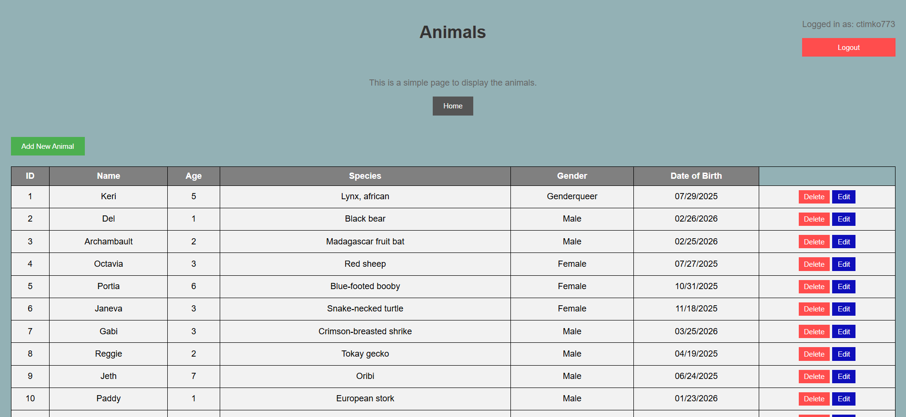

# Animal Database with CRUD operations
**A database with an interface that allows users to register and sign in and then perform all CRUD operations**

**Tech Stack**
- HTML
- CSS
- Python
- JavaScript
- Flask
- JWT

## Features
*The site allows the user to sign in or create an account and then Create, Update, or Delete an entry in the animal database*

### Instructions
1. Clone the repo and cd into it
    - `git clone https://github.com/ctimko773/Animals_CRUD_Databse`
    - `cd Animals_CRUD_Database`
2. Install dependencies
    - `pip install -r requirements.txt`
3. Start the server
    - `python app.py`
4. Open browser and navigate to the url
    - `https://localhost:5000`

